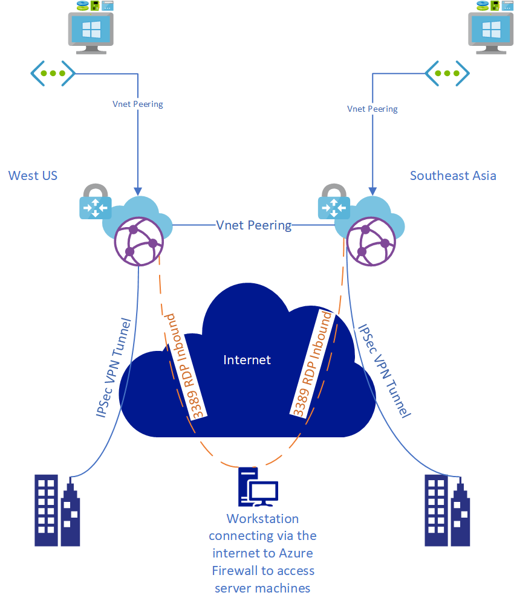

## Overview
This is an example script written in Terraform to help walk through deploy Virtual WAN to multiple Azure regions with VPN and ExpressRoute Gateways.

## Goal
The goal of this is to show an example of how to deploy Azure Virtual WAN via Terraform to enable cross region and on-premises connectivity via parameterized input.

## Examples
The script has examples of how to leverage modules and variables to provide code portability, reusability, and help with readability.

## The script will provision the following resources:
1. Resource Group
2. 1 Virtual Networks
3. 2 Subnets
    1. SubnetA/B for Spoke VNet
4. NSG + NSG Rule for RDP
5. Association of NSG to Spoke VNet Subnet A
6. Region VNet Peering between Hub and Spoke Vnet
7. Creates VWAN Hub
8. Creates VWAN ER and VPN Gateway
9. Creates VNet Connection between Hub VNet and VWAN Hub
10. Creates a Virtual Machine with Public IP in each region

Deployment of each environment is specified via a set of parameters (see tfvars file).

# Diagram of deployment
